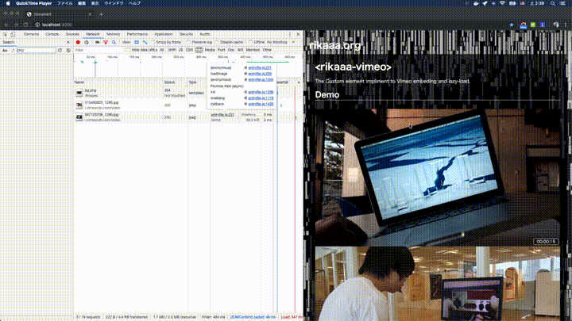

# `<rikaaa-vimeo>`
The Custom element impliment to Vimeo embeding and lazy-load.



## Installation
```bash
#HTML
<!-- If you want to use the Custom Element with browser without not support Webcomponents.-->
<script src="https://unpkg.com/@webcomponents/webcomponentsjs@2.2.10/webcomponents-loader.js"></script>

<script src="rikaaa-vimeo.js"></script>
```

## Usage
```bash
<rikaaa-vimeo id="148239556" vimeoid="148239556" size="1280x720"></rikaaa-vimeo>
```

## Attributes
|Attribute|Required|Description
----|----|----
|vimeoid = "string"|Required|The parameter to set Vimeo id.|
|size = "000x000"|Required|The parameter to set the size of video by text string. For example, indication of '1280x720' in case of width 1280 pixel and height 720 pixel.|
|loadtiming = "string"||The parameter to set timing of image loading by text string. This parameter is equivalent with "rootMargin" parameter of Intersection Observer API. The default value is "200px 0px 200px 0px". The unit is pixel or percentage.|
|query = "string"||The parameter to set query string of embed url. Default value is "?autoplay=1&title=0&byline=0&portrait=0"|

## Methods
|Method|Description|
----|----
|rikaaavimeo.init(Vimeo id)|The method initialize the custom element. The argument Vimeo id.|
|rikaaavimeo.setRoot(Element)|The method set Element Node as View-port. The Element is equivalent with "root" parameter of Intersection Observer API.|

## Events
- addEventListener("load",callback)  
_The event will be triggered when the custom element loaded._
```bash
var vimeo1 = document.getElementById("148239556");

vimeo1.addEventListener("load", function () {
    console.log("load");
});
```


- addEventListener("loadThumnail",callback)  
_The event will be triggered when the thumnail loaded._
```bash
var vimeo1 = document.getElementById("148239556");

vimeo1.addEventListener("loadThumnail", function (event) {
    console.log("load thumnail");
    console.log(event.detail.data);
});
```

- addEventListener("loadIframe",callback)  
_The event will be triggered when the Iframe loaded._
```bash
var vimeo1 = document.getElementById("148239556");

vimeo1.addEventListener("loadIframe", function () {
    console.log("load iframe");
});
```

## Browser Support
- Google Chrome  
- Safari  
- Firefox  
- Edge  
- IE 11+ (When using polyfill)

## License
MIT © [rikaaa.org](http://rikaaa.org/)